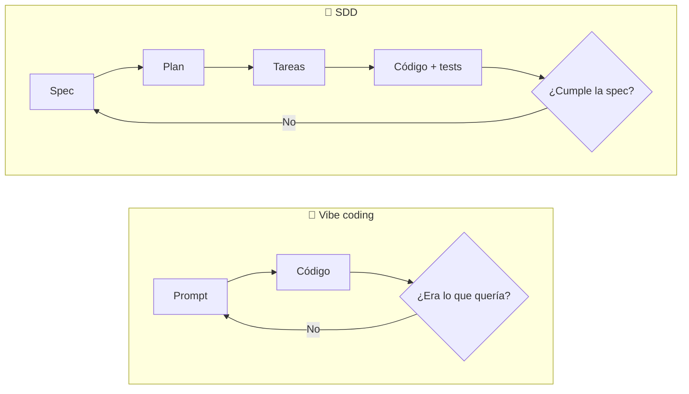
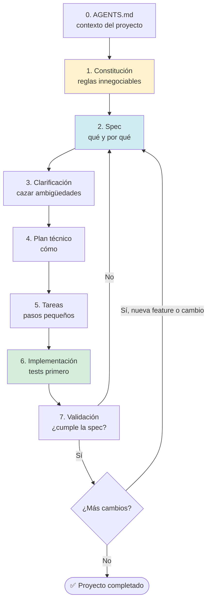

# 🧭 Spec-Driven Development (SDD) con IA
**Idea en una frase:** en vez de pedirle código a la IA y "rezar", primero **escribimos qué queremos y por qué** (la *especificación*), y dejamos que la IA implemente **contra ese documento**. Nosotros revisamos en cada paso.

---

## 📑 Índice
1. [Qué vas a llevarte](#1--qué-vas-a-llevarte)
2. [Antes de empezar (requisitos)](#2--antes-de-empezar-requisitos)
3. [TEORIA](#3--teoria)
4. [PRACTICA](#4--practica)
5. [CIERRE](#5--cierre)
6. [Glosario](#6--glosario)

---

## 1 · Qué vas a llevarte
Al terminar sabrás:
- ✅ Por qué programar con IA "a base de prompts" (*vibe coding*) falla en proyectos que hay que mantener.
- ✅ Qué es SDD y cuál es su flujo: **constitución → spec → clarificación → plan → tareas → implementación → validación**.
- ✅ Escribir una especificación clara con la notación **EARS**.
- ✅ Hacer tú mismo/a el ciclo completo con un mini-proyecto en Python.
- ✅ Cuándo SDD merece la pena y cuándo es matar moscas a cañonazos.

---

## 2 · Antes de empezar (requisitos)

Solo necesitamos lo que ya tenemos instalado:

- [ ] **VS Code**
- [ ] **Python 3.10+** (`python --version`)
- [ ] **Un agente/chat de IA.** Vale cualquiera:
  - GitHub Copilot Chat dentro de VS Code (el que vemos en otra píldora), o
  - OpenCode u otro agente de terminal, o
  - Un chat web (Claude, ChatGPT…) copiando y pegando ficheros. Es más lento, pero el método es idéntico.
- [ ] **Git** (para los checkpoints)

### Preparar el entorno

```bash
# 1. Clona el repo del taller (trae los checkpoints)
git clone https://github.com/<tu-usuario>/workshop-sdd.git
cd workshop-sdd

# 2. Crea TU carpeta de trabajo, separada del material
mkdir mi-biblioteca
cd mi-biblioteca

# 3. Entorno virtual (Windows: .venv\Scripts\activate)
python -m venv .venv
source .venv/bin/activate

# 4. Lo único que instalamos
pip install pytest
```

Abre `mi-biblioteca/` en VS Code. Ahí trabajaremos.

---

## 3 · TEORIA

### 3.1 El problema: la IA es un "compilador no determinista"

En programación clásica, el mismo código da **siempre** el mismo resultado. Con una IA, **el mismo prompt puede darte dos programas distintos**, porque responde por probabilidad.

Imagina que entras a una cocina y gritas *"¡hazme una pizza rica!"*. Puede salir con piña (que odias), sin queso o con el pepperoni bajo la masa. Eso es **vibe coding**.

SDD es dar una **hoja de pedido clara** antes de que nadie toque la harina:
*"12 pulgadas, masa fina, salsa picante, doble mozzarella; primero salsa, luego queso, luego pepperoni"*. Esa hoja es tu **spec**, y la fuente de verdad contra la que medimos el resultado.



**¿Por qué importa en la vida real?**

| Problema del vibe coding | Consecuencia |
|---|---|
| No hay requisitos escritos | No existe "correcto": existe "lo que la IA quiso" |
| Revisamos poco código | Fallos de seguridad, código inestable |
| El conocimiento vive en un chat | Al cerrar la pestaña, se pierde (el "problema de Jim": el que se fue y nadie sabe por qué funciona así) |
| Sin trazabilidad | Imposible saber *por qué* el código hace lo que hace |

> 🗣️ **Antes que los fans del vibe coding me tiren piedras:** el vibe coding **no es malo**. Es genial para prototipos desechables, pruebas de concepto o aprender una librería. El problema es usarlo para software que otros usarán y que **hay que mantener meses o años**.

### 3.2 Qué es (y qué no es) SDD

**Spec-Driven Development** = desarrollo dirigido por especificaciones: antes de generar código, se escribe un documento estructurado (normalmente en **Markdown**) que describe **el qué y el porqué**, no el cómo.

| ✅ SDD es | ❌ SDD no es |
|---|---|
| Un flujo de trabajo con humano en el medio | Documentar por documentar |
| La spec como artefacto principal | Dejar que la IA genere código que nadie revisa |
| Una forma de reducir la ambigüedad | Algo totalmente nuevo |

**No es nuevo.** Es el ciclo de vida del software de siempre con la IA haciendo una parte:

| Ciclo clásico | En SDD |
|---|---|
| Planificación | **Constitución** (reglas del proyecto) |
| Análisis de requisitos | **Spec** (+ clarificación) |
| Diseño | **Plan técnico** |
| Desglose de trabajo | **Tareas** |
| Implementación | La **IA** implementa |
| Testing | **Validación** contra la spec |
| Mantenimiento | Nueva spec o cambio de spec → repetir |

> 🧠 **Idea clave:** la IA hace más rápido el *escribir código*. Lo que **no** puede hacer por ti es decidir *qué* hay que construir ni responsabilizarse del resultado. Eso sigue siendo tuyo.

### 3.3 El flujo completo



🙋 La idea del **humano en el bucle** es que la IA no hace todo de golpe: **primero propone, y nosotros revisamos y aprobamos cada paso antes de continuar**.
Usamos Ask/Plan para que la IA analice y proponga sin tocar el código, y solo cuando estamos de acuerdo pasamos a Implementación.
Así mantenemos el control y evitamos que la IA tome decisiones por su cuenta que luego no sepamos explicar.

### 3.4 Los ficheros de un repo SDD

| Fichero | Para qué sirve | Cuándo cambia |
|---|---|---|
| `AGENTS.md` | Resumen del proyecto, comandos, convenciones, límites. Lo primero que lee el agente. **Corto**: es una Biblia pequeñita | Cuando cambia algo general |
| `docs/constitution.md` | Principios innegociables (stack, tests, estilo…) | Casi nunca |
| `specs/001-xxx/spec.md` | **Qué** y **por qué** de una funcionalidad | Por funcionalidad |
| `specs/001-xxx/plan.md` | **Cómo** (módulos, datos, decisiones) | Por funcionalidad |
| `specs/001-xxx/tasks.md` | Checklist de tareas pequeñas | Por funcionalidad |

> 📎 `AGENTS.md` ya es un estándar que leen Copilot, Claude Code, Codex, OpenCode… Si tu herramienta usa otro nombre (por ejemplo `CLAUDE.md`), crea ese fichero y haz que apunte a `AGENTS.md`. (Cómo escribir buen contexto de agente es una conversacion para otro dia, si me invitas a café)

### 3.5 Anatomía de una spec

Una buena spec responde **qué** y **por qué**. **No** menciona librerías, arquitectura ni nombres de funciones. Eso va en el plan.

```markdown
# Spec 001 — <nombre>

## Contexto
Por qué existe esto y qué problema resuelve.

## Usuarios e historias de usuario
Como <rol>, quiero <acción> para <beneficio>.

## Requisitos funcionales (RF)
RF1 · ... (con criterios de aceptación)

## Requisitos no funcionales (RNF)
Rendimiento, mensajes de error, idioma...

## Casos límite
Qué pasa si hay datos vacíos, duplicados, ficheros corruptos...

## Fuera de alcance
Lo que NO haremos ahora (¡tan importante como lo demás!)

## Criterios de finalización (Definition of Done)
Cuándo damos esta spec por cumplida.

## Dudas abiertas
Lo que aún no está decidido.
```

### 3.6 Notación EARS: escribir requisitos sin ambigüedad

**EARS** (*Easy Approach to Requirements Syntax*) son 5 plantillas de frase. Obligan a ser concretos, y a la IA le encanta porque no hay dónde "interpretar".

| Tipo | Plantilla | Ejemplo (biblioteca) |
|---|---|---|
| **Ubicuo** (siempre) | El sistema <hará>… | El sistema guardará todos los datos en un único archivo JSON. |
| **Evento** | **Cuando** <evento>, el sistema <respuesta> | Cuando el usuario ejecute `devolver 3`, el sistema marcará el libro 3 como disponible. |
| **Estado** | **Mientras** <estado>, el sistema… | Mientras no exista ningún libro, el sistema invitará a añadir el primero. |
| **No deseado** | **Si** <problema>, **entonces** el sistema… | Si el libro ya está prestado, entonces el sistema mostrará quién lo tiene, sin modificar nada. |
| **Opcional** | **Donde** <opción>, el sistema… | Donde se pase `--todos`, el sistema mostrará también los libros prestados. |

> ✍️ **Truco:** no hace falta memorizarlo. Se lo pedimos a la IA en el prompt ("redacta con notación EARS") y **tú revisas** que cada frase sea verificable.

### 3.7 Tres niveles de SDD

La gran pregunta es: **¿qué pasa con la spec una vez que el código existe?**

| Nivel | La spec... | Fuente de verdad | Compromiso |
|---|---|---|---|
| **Spec-first** | Arranca el desarrollo y luego se deja de mirar | El código | Bajo |
| **Spec-anchored** | Acompaña al código y se mantiene sincronizada | Código + spec | Medio |
| **Spec-as-source** | *Es* el programa; el código casi no se revisa | La spec | Alto |

Hoy trabajamos entre **spec-first y spec-anchored**: la spec es el punto de partida, y si cambiamos algo importante lo reflejamos en ella. *Spec-as-source* sigue siendo experimental y arriesgado: el código no se revisa y la IA no es determinista.

### 3.8 ¿Y las herramientas? (Spec Kit, Kiro, BMAD, OpenSpec…)

Existen frameworks que **automatizan este mismo flujo** con comandos:

| Herramienta | Qué es |
|---|---|
| **GitHub Spec Kit** | Toolkit open source de GitHub. Comandos tipo `/specify`, `/plan`, `/tasks`, `/implement` |
| **Kiro (AWS)** | Editor basado en VS Code con flujo spec → diseño → tareas |
| **BMAD** | Framework muy completo y más restrictivo |
| **OpenSpec** | Orientado a ir manteniendo las specs vivas junto al código |

> 🎯 **Mensaje clave:** *los frameworks pasan de moda, el método se queda.* Por debajo son **prompts + skills + plantillas**. Hoy lo hacemos **a mano** para que entiendas cada paso. Después puedes usar un framework sabiendo qué hace, o crear el tuyo.
>
> ⚠️ Aviso real de quien los usa a diario: estos flujos **consumen muchos tokens**, porque generan muchos ficheros por funcionalidad.

### 3.9 Cuándo sí y cuándo con cuidado

| 👍 Brilla en | ⚠️ Cuidado en |
|---|---|
| Proyectos nuevos (*greenfield*) | Código heredado enorme: la IA se pierde en el contexto |
| Aplicaciones de negocio con CRUD y casos de uso | Software crítico o regulado (sanidad, automoción…): hay que cumplir trazabilidad exigida |
| Herramientas internas, prototipos que van a crecer | Sistemas donde el "porqué" solo está en la cabeza de alguien: la spec saldrá incompleta |
| Patrones repetitivos | Un script de 10 líneas: SDD es demasiado |

Y una limitación importante, **la IA no es determinista**: con la misma spec, dos ejecuciones pueden generar código distinto. No pasa nada mientras **cumpla la spec y pase los tests**, igual que dos desarrolladores resolverían la misma tarea de forma distinta.

> 🧑‍⚖️ **Tú eres responsable de todo lo que genera la IA.** Si falla, no despiden a la IA.

---

## 4 · PRACTICA

### 🎯 El proyecto: `biblioteca-cli`

Una aplicación de **terminal en Python** para gestionar los préstamos de una biblioteca.

- Añadir un libro
- Prestarlo a una persona
- Devolverlo
- Listar libros y su estado

Tiene reglas con casos límite (no prestar dos veces el mismo libro, no duplicar…) que hacen que una spec valga la pena.

> 🔁 **Mientras la IA piensa** (puede tardar 1–2 min por paso): lee la respuesta, y comprueba si responde a lo que querías. Esa es tu tarea.

### ℹ️ Cómo usar los prompts

- Cada prompt va en un bloque `text`. **Cópialo tal cual** en tu agente.
- 🧠 Donde diga **modo Plan/Ask**, actívalo (si tu agente lo tiene) o añade al prompt *"no escribas código ni ficheros todavía; solo propón"*.
- Las respuestas de tu IA **no serán idénticas** a las mías. Es normal y es el punto de la charla. Compara con el checkpoint solo si te pierdes.

---

### 🔧 Setup · Estructura inicial

Dentro de `mi-biblioteca/` crea la estructura vacía:

```bash
mkdir docs specs
touch AGENTS.md
```

---

### Paso 1 · `AGENTS.md` y constitución

#### 1A · Escribe `AGENTS.md` (a mano, es corto)

Aquí **decides tú**. Si no sabes qué tipo de proyecto quieres, se lo estás delegando todo a la IA. Pega esto en `AGENTS.md`:

```markdown
# AGENTS.md — biblioteca-cli

## Proyecto
Aplicación de terminal en Python para gestionar préstamos de libros
(añadir, prestar, devolver, listar). Proyecto educativo.

## Estructura prevista
- biblioteca/core.py     → lógica de negocio (sin input/print)
- biblioteca/storage.py  → lectura/escritura del JSON
- biblioteca/cli.py      → interfaz de línea de comandos
- tests/                 → tests con pytest

## Comandos
- Ejecutar: python -m biblioteca <comando>
- Tests: pytest

## Convenciones
- Python 3.10 o superior, solo biblioteca estándar + pytest
- Código y nombres en inglés; mensajes al usuario en español

## Documentos
- Reglas del proyecto: docs/constitution.md
- Especificaciones: specs/

## Límites
- No añadir dependencias sin avisar
- No modificar docs/constitution.md sin permiso

## Al terminar cualquier tarea
- Ejecutar pytest y mostrar el resultado
```

#### 1B · Genera la constitución con la IA

La constitución son los **principios innegociables**: pocos, cortos y verificables. 🧠 **Modo Plan/Ask**.

```text
Vamos a crear la constitución de un proyecto: un cliente de terminal en
Python para gestionar préstamos de libros (añadir, prestar, devolver y
listar). Es un proyecto educativo que debe poder mantener una persona junior.

Lee AGENTS.md primero.

Propón el contenido de docs/constitution.md con 6 principios innegociables,
cortos y verificables, que cubran: simplicidad del stack, relación entre la
spec y el código, separación entre lógica e interfaz, política de tests,
persistencia de datos e idioma.

No escribas código. Muéstrame la propuesta antes de crear el fichero.
```

**✋ Revisa:** ¿cada principio se puede *comprobar*? ("código limpio" no se puede; "la lógica no usa `print` ni `input`" sí.) Si estás de acuerdo, dile *"Perfecto, crea el fichero"*.

> 📍 **Checkpoint:** `git checkout paso-1`

---

### Paso 2 · La especificación

Ahora el corazón del método. Pedimos a la IA que **nos entreviste** para sacar los casos límite que no hemos pensado.

🧠 **Modo Plan/Ask. No dejes que escriba código.**

```text
No escribas código en ningún momento.

Vamos a redactar la especificación de la primera funcionalidad de
biblioteca-cli. Lee antes docs/constitution.md y AGENTS.md: son las normas que
debe cumplir cualquier especificación.

Idea inicial: una CLI con cuatro comandos: añadir un libro, prestarlo a una
persona, devolverlo y listar los libros con su estado.

Tu trabajo: hazme preguntas UNA A UNA para eliminar ambigüedades, casos límite
y comportamientos ante errores, y definir qué queda fuera del MVP. Máximo 6
preguntas.

Con mis respuestas, genera specs/001-biblioteca-mvp/spec.md con esta
estructura: contexto, usuarios e historias de usuario, requisitos funcionales
(RF1, RF2…) con criterios de aceptación y notación EARS en español, requisitos
no funcionales, casos límite, fuera de alcance, criterios de finalización y
dudas abiertas.

Solo el QUÉ y el POR QUÉ: nada de stack, arquitectura ni nombres de funciones.
```

**¿Qué hacer cuando pregunte?** Responde con criterio propio. Ejemplos de preguntas que debería hacerte:

- ¿Cómo se identifica un libro? ¿Qué pasa si añado uno que ya existe?
- ¿Se puede prestar un libro ya prestado?
- ¿Qué muestra el listado?
- ¿Qué dejamos fuera del MVP? *(Sugerencia: borrar libros, historial, multas, fechas de vencimiento.)*

> 🧠 **Fíjate:** cuanto más precisas tus respuestas, mejor spec. Si ya lo tienes todo claro en la cabeza, puedes meterlo directamente en el prompt y saltarte las preguntas.

Cuando acabe, **revisa `specs/001-biblioteca-mvp/spec.md`**. Debería tener frases como estas (las tuyas serán parecidas, no iguales):

> *Cuando el usuario ejecute `prestar 2 "Ana"`, el sistema marcará el libro 2 como prestado a Ana.*
> *Si el libro ya está prestado, entonces el sistema mostrará quién lo tiene, sin modificar los datos.*

> 📍 **Checkpoint:** `git checkout paso-2`

---

### Paso 3 · Clarificación

¿La spec no te convence o crees que falta algo? Tienes dos caminos: **editarla tú** a mano, o pedirle a la IA que actúe como un QA riguroso. 🧠 **Modo Plan/Ask**:

```text
Revisa @specs/001-biblioteca-mvp/spec.md como si fueras un QA muy profesional.

Lista:
- Ambigüedades
- Contradicciones
- Casos límite no cubiertos
- Conflictos con docs/constitution.md

No propongas soluciones todavía y no modifiques ningún fichero.
Formato: lista numerada.
```

Elige qué hallazgos te parecen razonables y pide que **reescriba la spec** teniéndolos en cuenta. Repite las veces que haga falta. **Este bucle es barato** (solo texto) y **corregir ahora cuesta mucho menos que corregir código después**.

---

### Paso 4 · El plan técnico

Aquí por fin entra el **cómo**. 🧠 **Modo Plan/Ask**.

```text
Lee docs/constitution.md y @specs/001-biblioteca-mvp/spec.md.

No escribas código.

Genera specs/001-biblioteca-mvp/plan.md con:
- Estructura de módulos y qué responsabilidad tiene cada uno
- Modelo de datos del JSON (con un ejemplo)
- Comandos y salidas esperadas
- Decisiones técnicas y por qué (incluido dónde se guarda el fichero de datos)
- Estrategia de tests

Todo debe respetar la constitución y cubrir cada RF de la spec.
```

**✋ Revisa:**
- ¿Respeta la separación lógica / interfaz de la constitución?
- ¿Tomó decisiones que no te gustan? (Por ejemplo, dónde guarda el fichero.) Edita o pídele que lo cambie.

> 📍 **Checkpoint:** `git checkout paso-4`

---

### Paso 5 · Las tareas

Dividimos el plan en piezas pequeñas ("divide y vencerás"). 🧠 **Modo Plan/Ask**.

```text
A partir de @specs/001-biblioteca-mvp/spec.md y @specs/001-biblioteca-mvp/plan.md,
genera specs/001-biblioteca-mvp/tasks.md.

Tareas pequeñas (máximo 20–30 minutos cada una), en orden de dependencia, cada
una con los RF que cubre y una línea "Hecho cuando…" verificable.
Usa checkboxes - [ ].
```

**✋ Revisa:**
- ¿Cada tarea es pequeña y verificable?
- ¿Todos los RF aparecen cubiertos por alguna tarea? (**trazabilidad**: cada tarea apunta a un requisito)

Ejemplo de cómo debería verse una tarea:

```markdown
- [ ] **T2 · Storage: leer y guardar JSON**
  - Cubre: RF1, RF10
  - Hecho cuando: los tests de storage pasan y un JSON inválido no se sobrescribe
```

> 📍 **Checkpoint:** `git checkout paso-5`

---

### Paso 6 · Implementación

Ahora **sí** dejamos que escriba código. ✍️ **Modo Agent / Edit** (el que permite modificar ficheros).

**Una tarea cada vez.** No le pidas todo de golpe: así controlas lo que hace.

```text
Implementa SOLO la tarea T1 de @specs/001-biblioteca-mvp/tasks.md,
siguiendo @specs/001-biblioteca-mvp/plan.md y docs/constitution.md.

Escribe primero los tests, luego el código. Ejecuta pytest y muéstrame el
resultado. Al terminar, marca T1 en tasks.md, indica qué requisitos
funcionales cubre y PARA. No empieces T2.
```

Revisa → ejecuta tú también `pytest` en tu terminal → pasa a la siguiente cambiando solo el número de tarea (**T2, T3…**).

> 💡 **Para ir rápido en la sesión:** hacemos T1 y T2 en vivo juntos. Si el tiempo aprieta, el resto lo recuperas con el checkpoint `paso-6`.

> ⚠️ **Obligatorio en la vida real:** leer el código y los tests que genera la IA. Hoy nos saltamos esa lectura profunda solo por falta de tiempo.

> 📍 **Checkpoint:** `git checkout paso-6`

---

### Paso 7 · Validación

Cuando todas las tareas estén hechas, comprobamos **requisito por requisito** que la spec se cumple. 🧠 **Modo Plan/Ask** (solo lee y ejecuta tests).

```text
Valida la implementación contra @specs/001-biblioteca-mvp/spec.md.

Recorre la spec requisito por requisito (RF1 a RFn). Para cada uno indica:
qué código y qué test lo cubre y el resultado de ejecutarlo.

Si algún requisito no está cubierto, dilo claramente.
Después comprueba los criterios de finalización y da un veredicto final:
"La spec está cumplida" o "no está cumplida" y por qué.
```

Y pruébalo tú **a mano** como lo haría un usuario real:

```bash
python -m biblioteca add "El Quijote" "Cervantes"
python -m biblioteca list
python -m biblioteca lend 1 "Ana"
python -m biblioteca lend 1 "Luis"   # ← debe dar error y decir quién lo tiene
python -m biblioteca return 1
```

🎉 Si el veredicto es positivo y tus pruebas manuales coinciden: **has completado un ciclo SDD**.

---

### Paso 8 · Llega un cambio

Aquí se ve por qué SDD ayuda con el **mantenimiento**. Llega un requisito nuevo:

> *"Una persona no puede tener más de 3 libros prestados a la vez."*

**¿Qué hacemos?** Volvemos al principio, **sin tocar la constitución**:

1. Se actualiza la **spec** (nuevo RF + caso límite).
2. Se revisa el **plan** (¿afecta al modelo de datos?).
3. Se añaden **tareas** nuevas.
4. Se implementa **tests primero**.
5. Se **valida** de nuevo.

```text
Nuevo requisito: una persona no puede tener más de 3 libros prestados a la vez.

Actualiza @specs/001-biblioteca-mvp/spec.md (nuevo RF con EARS y el caso
límite correspondiente), revisa si @specs/001-biblioteca-mvp/plan.md necesita
cambios y añade las tareas necesarias a tasks.md.

No escribas código todavía. Muéstrame los cambios que propones.
```

> 🔎 **Lo valioso:** si dentro de 6 meses aparece un bug, tienes **el historial escrito** de qué se pidió, por qué y cómo se decidió.

---

### 🛟 Plan B: si algo falla

| Problema | Solución |
|---|---|
| La IA tarda o no responde | `git checkout paso-N` y sigue desde ahí |
| No tengo agente instalado | Usa un chat web: pega el prompt, copia la respuesta al fichero |
| Mi spec salió muy distinta | Normal. Revisa que cumpla tus criterios; no hace falta que sea igual a la mía |
| `pytest` falla | Copia el error y pídele a la IA que lo arregle **sin cambiar la spec** |
| Me he perdido | Mira el repo `solucion/` y ponte al día |

---

## 5 · CIERRE

### ✅ Resumen en 7 líneas

1. La IA no es determinista: **sin especificación, el resultado es una lotería**.
2. SDD = el ciclo de vida clásico, con IA haciendo el trabajo de implementación.
3. Flujo: **constitución → spec → clarificación → plan → tareas → implementación → validación**.
4. La spec responde **qué y por qué**; el plan responde **cómo**.
5. EARS reduce la ambigüedad: *Cuando… / Si… entonces… / Mientras…*
6. **Humano en el bucle** siempre: tú revisas antes y después de la IA.
7. **Método > herramienta**: Spec Kit, Kiro, BMAD… son atajos que automatizan esto.

### ⚖️ Lo bueno y lo que cuesta

| 👍 Ventajas | 👎 Costes |
|---|---|
| Menos ambigüedad, menos "adivinar" | Más documentos que escribir y revisar |
| Documentación viva en el repo | Consume más tokens/uso de IA |
| Trazabilidad requisito → tarea → test | Puede parecer "burocracia" en cosas pequeñas |
| Se aprende más que con vibe coding | Sigue sin ser determinista: hay que revisar |

### 🏠 Deberes

1. **Rehaz la práctica** sin copiar mis ficheros: tu idea, tu constitución, tu spec.
2. **Segunda spec:** añade `specs/002-...` con una funcionalidad nueva, p. ej. *"fecha de devolución prevista y aviso de retrasos"*.
3. **Reto con lo que ya tenemos instalado:** haz una spec `003-persistencia-mysql` que migre el almacenamiento de JSON a **MySQL** (usa Workbench para ver las tablas). Observa qué documentos cambian: ¿constitución? ¿plan? ¿tareas?
4. **Fase avanzada:** convierte uno de los prompts en una *skill* o plantilla reutilizable de tu agente.

---

## 6 · Glosario

| Término | Significado |
|---|---|
| **SDD** | *Spec-Driven Development*: desarrollo dirigido por especificaciones |
| **Vibe coding** | Programar con IA a base de prompts sueltos, sin requisitos ni revisión |
| **Spec** | Documento que describe qué y por qué de una funcionalidad |
| **Constitución** | Reglas generales del proyecto que toda spec debe respetar |
| **Plan** | Decisiones técnicas para implementar la spec |
| **Tarea** | Paso pequeño, verificable, derivado del plan |
| **EARS** | Notación para escribir requisitos sin ambigüedad |
| **RF / RNF** | Requisito Funcional / No Funcional |
| **MVP** | Producto mínimo viable |
| **DoD** | *Definition of Done*: criterios para dar algo por terminado |
| **Modo Plan** | Modo del agente que propone sin tocar código |
| **Drift** | Cuando el código se desvía de la spec |
| **Human in the loop** | La persona revisa antes y después de que actúe la IA |
| **No determinista** | El mismo prompt puede dar resultados distintos |
| **Greenfield / Brownfield** | Proyecto nuevo / proyecto ya existente |
| **Trazabilidad** | Poder seguir un requisito hasta su tarea, código y test |

Herramientas para investigar después: **GitHub Spec Kit**, **Kiro**, **BMAD**, **OpenSpec**.

---

<p align="center">¿Dudas, mejoras o algo que no cuadra? Abre un <em>issue</em> en este repo 🙌</p>
